# OpenShift UPI on AWS with Terraform

This project provides a production-grade, modular Terraform configuration to deploy OpenShift Container Platform (OCP) cluster on Amazon Web Services (AWS) using the User-Provisioned Infrastructure (UPI) method.

## Architecture Overview

The infrastructure consists of the following components:

- **VPC**: A dedicated Virtual Private Cloud (VPC) to isolate the cluster resources
- **Subnets**: Public and private subnets across multiple Availability Zones for high availability
- **Bastion Host**: A bastion host in the public subnet that acts as a NAT gateway, load balancer (using HAProxy), and access point for managing the cluster
- **OpenShift Nodes**: Bootstrap and master nodes deployed in private subnets
- **Route 53**: A private hosted zone for internal DNS resolution within the cluster

### Architecture Diagram

Below is a Mermaid diagram representing the architecture:

```mermaid
graph TD
    subgraph "AWS Cloud"
        subgraph "VPC (10.0.0.0/16)"
            subgraph "Public Subnet (10.0.1.0/24)"
                Bastion[Bastion Host<br/>NAT Gateway<br/>HAProxy<br/>10.0.1.10]
            end

            subgraph "Private Subnet 1 (10.0.2.0/24)"
                Bootstrap[Bootstrap Node<br/>10.0.2.10]
                Master1[Master Node 1<br/>10.0.2.11]
            end

            subgraph "Private Subnet 2 (10.0.3.0/24)"
                Master2[Master Node 2<br/>10.0.3.11]
            end

            subgraph "Private Subnet 3 (10.0.4.0/24)"
                Master3[Master Node 3<br/>10.0.4.11]
            end

            InternetGateway[Internet Gateway]
            RouteTablePublic[Public Route Table]
            RouteTablePrivate[Private Route Table]
            Route53[Route 53 Private Zone]
        end
    end

    User["👤 User"] --> Bastion
    Internet["🌐 Internet"] --> InternetGateway
    InternetGateway --> RouteTablePublic
    RouteTablePublic --> Bastion
    Bastion --> RouteTablePrivate
    RouteTablePrivate --> Bootstrap
    RouteTablePrivate --> Master1
    RouteTablePrivate --> Master2
    RouteTablePrivate --> Master3
    Route53 --> Bootstrap
    Route53 --> Master1
    Route53 --> Master2
    Route53 --> Master3

    Bootstrap --> Master1
    Bootstrap --> Master2
    Bootstrap --> Master3
```



## Project Structure

The project follows a modular Terraform structure:

```

## Prerequisites

Before you begin, ensure you have the following:

1.  **AWS Account**: An AWS account with the necessary permissions to create the resources defined in the Terraform configuration.
2.  **Terraform**: Terraform installed on your local machine. You can download it from the [official Terraform website](https://www.terraform.io/downloads.html).
3.  **AWS CLI**: The AWS Command Line Interface configured with your credentials. See the [AWS CLI documentation](https://docs.aws.amazon.com/cli/latest/userguide/cli-chap-configure.html) for instructions.
4.  **OpenShift Pull Secret**: A valid OpenShift pull secret. You can get this from the [Red Hat OpenShift Cluster Manager](https://console.redhat.com/openshift/install/pull-secret).
5.  **SSH Key Pair**: An SSH key pair created in the AWS region where you plan to deploy the cluster.

## Deployment Steps

1.  **Clone the Repository**

    ```bash
    git clone <your-repository-url>
    cd <repository-name>
    ```

2.  **Configure Your Environment**

    - Rename the `terraform.tfvars.example` file to `terraform.tfvars`.
    - Open `terraform.tfvars` and update the values for your environment. Pay special attention to `region`, `key_name`, and other project-specific variables.

3.  **Provide the Pull Secret**

    - Create a file named `pull-secret.oneline.txt` in the root of the project.
    - Paste your OpenShift pull secret into this file. Ensure it is a single line of JSON.

4.  **Initialize Terraform**

    Run the following command to initialize the Terraform workspace and download the required providers:

    ```bash
    terraform init
    ```

5.  **Plan the Deployment**

    Generate an execution plan to preview the changes that Terraform will make:

    ```bash
    terraform plan
    ```

6.  **Apply the Configuration**

    Deploy the infrastructure:

    ```bash
    terraform apply
    ```

    Enter `yes` when prompted to confirm the deployment.

## Post-Deployment

Once the `terraform apply` command completes, the OpenShift cluster will be up and running. The outputs will display important information, such as the bastion host's public IP and the private IPs of the cluster nodes.

You can SSH into the bastion host to manage the cluster using `oc` and `kubectl` commands, which are pre-installed and configured by the `user_data` script.

## Cleaning Up

To destroy all the resources created by this Terraform configuration, run:

```bash
terraform destroy
```

Enter `yes` when prompted to confirm the deletion.